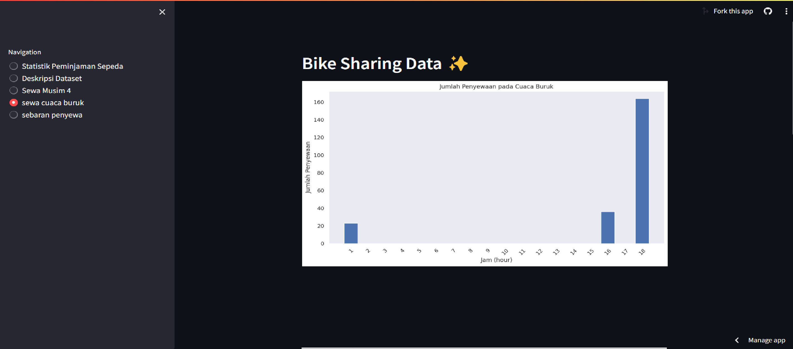

# Dicoding Analisis Dashboard ✨

## Setup environment
```
python -m venv .Env
.env\Scripts\Activate
pip install pandas matplotlib seaborn streamlit
```

## Run steamlit app
```
streamlit run dashboard.py
```

## streamlit app
```
https://irfanwahyr-dicoding-analisis-python-dashboard-xqlhkt.streamlit.app/

```

## ScreenShot aplikasi





